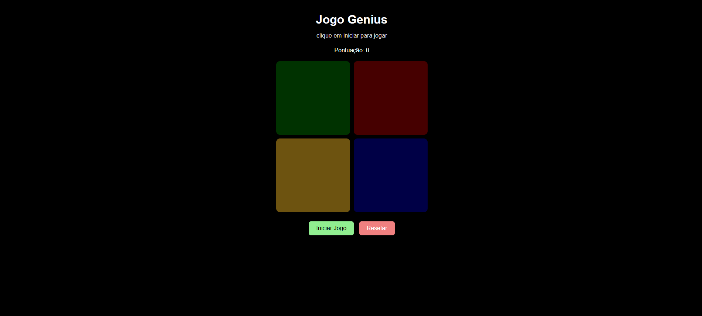

# Projeto Genius Facil

Jogo da memoria inspirado no classico Genius, desenvolvido com `HTML`, `CSS` e `JavaScript`.

O objetivo do jogador e observar a sequencia de cores exibida pelo jogo e repeti-la corretamente a cada rodada. A cada acerto, uma nova cor e adicionada a sequencia, aumentando a dificuldade.

## Preview do projeto

Espaco reservado para a print do projeto funcionando:



Se ainda nao tiver criado a imagem, voce pode manter esse caminho como referencia e adicionar o arquivo depois.

## Funcionalidades

- Inicio da partida com botao de controle
- Geracao aleatoria de sequencias
- Validacao dos cliques do jogador
- Contador de pontuacao
- Reinicio do jogo com botao `Resetar`
- Interface responsiva para telas menores

## Tecnologias utilizadas

- `HTML5`
- `CSS3`
- `JavaScript`

## Estrutura do projeto

```bash
Projeto-Genius-Facil/
├── > assets
├── index.html
├── style.css
├── script.js
└── README.md

```

## Como executar o projeto

1. Baixe ou clone este repositorio.
2. Abra a pasta do projeto no seu computador.
3. Execute o arquivo `index.html` no navegador.

## Como jogar

1. Clique no botao `Iniciar Jogo`.
2. Observe atentamente a sequencia de cores exibida.
3. Repita a mesma ordem clicando nos quadrados coloridos.
4. A cada rodada correta, uma nova cor sera adicionada.
5. Se errar a sequencia, o jogo termina.

## Logica do projeto

O funcionamento do jogo acontece da seguinte forma:

- O sistema sorteia uma cor aleatoria e adiciona na sequencia do jogo
- A sequencia e exibida visualmente para o jogador
- O jogador tenta repetir a ordem correta
- O sistema compara cada clique com a sequencia esperada
- Se estiver tudo certo, a rodada avanca e a pontuacao aumenta

## Melhorias futuras

- Adicionar sons para cada cor
- Criar niveis de dificuldade
- Exibir recorde de pontuacao
- Melhorar animacoes visuais
- Adicionar tela final com opcao de reiniciar
- Salvar localmente a pontuação
---
